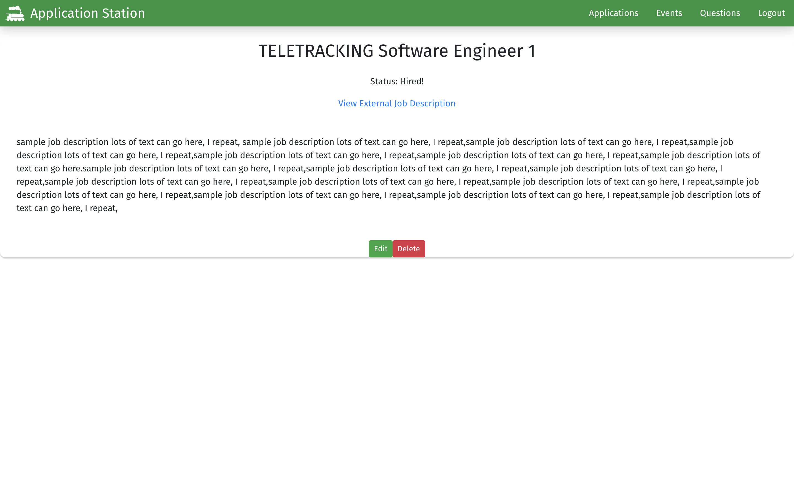

# Application Station

## What is Application Station?

Application Station is a single-page React application that assists users with their job search. Users can save Applications that they are interested in and keep track of their progress through applying, interviewing, and the final hiring decision. Users can track events related to each application, like "Applied on this day" or "Interview at the main office". Users can also practice asking and answering interview questions.

## Applications

This is the landing page of a logged-in user. Users can see their saved job applications.

Users can also save a new job application.

Users can also view the details of their application, as well as edit and delete the application.

## Events

Users can add events that are tied to a specific job application, as well as edit and delete each event.

## Questions

New users will receive a series of example interview questions when they create an account. Users are able to add their own questions as well.

When a user selects a question, they will be routed to the detail view of that question. In the detail view, a user can edit or delete the question, as well as add a response for practice or records purposes.

# Getting Started

1. Create a new directory in your terminal. Clone down this repository by clicking the "Clone or Download" button above, copying the SSH key, and running the following command in your terminal `git clone sshKeyGoesHere`.

1. `cd application-station` into the directory of the app that contains `package-lock.json` and `package.json`.

1. Run `npm install` and wait for all dependencies to be installed.

1. Go to https://github.com/RyanCrowleyCode/application-station-api and follow the instructions to set up the API in a seperate directory from the Bangazon Client directory. Then complete the next two steps.

1. Run `npm start` to verify that installation was successful and start the application.

1. Go to http://localhost:3000/ to view the app. 

